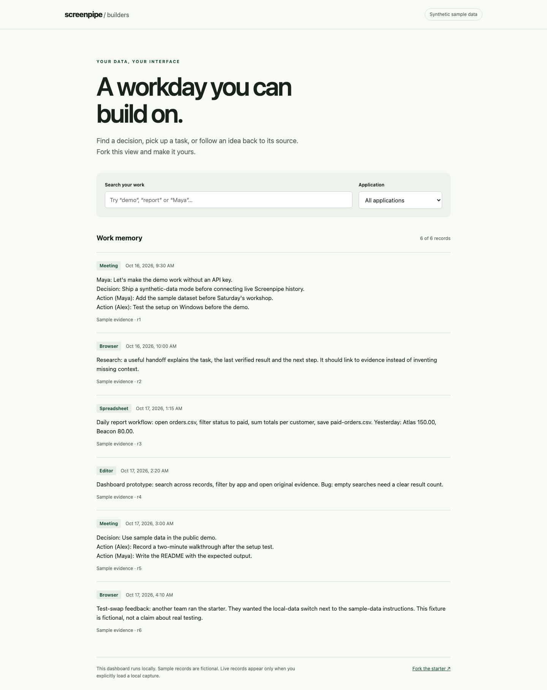

<!-- screenpipe — AI that knows everything you've seen, said, or heard -->
<!-- https://screenpipe.com -->
# Build agents that remember

Three small projects to fork for the [42 Paris hackathon, October 16 to 18](https://luma.com/bnre6nou). Run them on fictional data first, then connect your own Screenpipe history.

## Run in two minutes

Install [Bun](https://bun.sh/docs/installation) 1.3 or newer, then:

```sh
git clone https://github.com/screenpipe/hackathon-starter.git
cd hackathon-starter
bun run demo
bun start
```

Open **http://localhost:4242**. There are no package dependencies, no AI key required, and no install step. The demo also creates a follow-up draft and a reviewed sample workflow in `output/`. Those files stay on your computer.



## Pick a project

| Starter | What works now | Make it yours |
|---|---|---|
| [Meeting to follow-up](examples/meeting-followup/README.md) | Extract explicit decisions and actions with references. Optionally use your own AI provider for unstructured transcripts. | CRM review, project handoff, promise tracker |
| [Work session to workflow](examples/workflow-replay/README.md) | Read a sample work-session procedure and replay a paid-order report after explicit approval. | Add another reviewed, bounded operation |
| [Personal work dashboard](examples/work-dashboard/README.md) | Search records, filter by app and open original local evidence. | Research timeline, study dashboard, debugging history |

The event tracks are **Agents That Remember**, **Your Data, Your Interface**, and **Wildcard**. These examples are starting points, not restrictions. [More project ideas](ideas.md).

## Participant checklist

1. Register through [the event page](https://luma.com/bnre6nou). Use the organizer's Discord invitation and follow its `#hackathon-access` instructions.
2. Get your participant Business access link from the organizers. Individual redemption links are private and must not be committed to a repo. Access rollout status and terms will be linked here once verified.
3. Install [Screenpipe](https://screenpipe.com/download), enable the permissions it requests and capture a small, non-sensitive work session.
4. Run a sample above. Then follow [local-data setup](docs/local-data.md).
5. Test your project with someone outside your team. Record what failed and fix it.
6. Use the [submission checklist](docs/submission.md) to package your repo, setup instructions and two-minute demo. Organizers confirm the final submission destination and deadline.

## Local data and AI

Sample mode runs without Screenpipe. Live mode uses its authenticated local API and reads at most 20 records in the time window you choose. It does not scrape other apps or read the recording database directly.

The normal demo does not call an AI provider. `bun run meeting --ai` explicitly sends the selected records to the provider configured in `.env`; that provider may charge separately. Inspect the selected records before using it. The model produces a draft, and the starter never sends email or changes a CRM.

`output/`, `local-data/` and `.env` are ignored by Git. Use fictional or permissioned data in public demos. Recording and optional cloud features have their own data flows; see [Screenpipe's documentation](https://docs.screenpipe.com).

## Check your fork

```sh
bun test
bun run demo
bun run workflow --approve
```

The sample report should contain `Atlas,150.00` and `Beacon,80.00`. The follow-up should contain two decisions and four actions, each referencing its sample record. The dashboard should show six records; searching `Maya` should show two.

## Resources

- [Screenpipe MCP setup](https://github.com/screenpipe/screenpipe/tree/main/packages/screenpipe-mcp#installation)
- [Screenpipe cloud plugin](https://github.com/screenpipe/screenpipe-cloud)
- [Gemini CLI extension](https://github.com/screenpipe/gemini-cli-extension)
- [More community projects](https://github.com/screenpipe/awesome-screenpipe)
- [Optional advanced River training project](https://github.com/screenpipe/river-ai-screenpipe-training), with separate compute/model requirements

The original code and fictional fixtures in this repo use the MIT license. Screenpipe and linked projects have their own licenses. Forking this starter does not change those terms.
